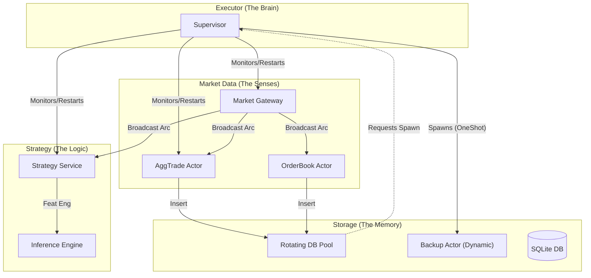

# Binance HFT Bot (RISC-V Edition)

> **A high-frequency algorithmic trading appliance built for the Orange Pi RV2 (RISC-V).**  
> *Rust / Tokio / Tract / SQLite / Fedora / ROCm*

## 📖 Overview

This project represents a shift from traditional cloud-based trading bots to **highly optimized edge computing**. It is a self-contained "Trading Appliance" designed to run on a single-board RISC-V computer (Orange Pi RV2), performing real-time data ingestion, feature engineering, ML inference, and order execution completely on-device.

The core philosophy is **Latency vs. Bandwidth**. By moving the compute to the edge, we eliminate network round-trips for inference and gain complete control over the hardware execution environment.

## 🚀 Philosophy & Vision

### 1. The "Appliance" Model
The bot is not a script running on a VPS; it is an embedded system. The hardware (RISC-V X1-8core) and software (Rust async runtime) are tuned in unison.
*   **Training:** Heavy lifting (Deep Learning) happens on a Fedora Workstation with AMD ROCm GPUs.
*   **Inference:** Optimized ONNX models run efficiently on the RISC-V CPU using `tract`.

### 2. Rust as the Foundation
We use Rust not just for speed, but for **correctness** and **memory safety**.
*   **Type Safety:** `NewType` patterns for Prices and Quantities prevent catastrophic math errors.
*   **Concurrency:** `tokio` actor-based architecture handles massive throughput without race conditions.
*   **Zero-Copy:** Data is ingested via WebSockets and broadcast to analysis engines without unnecessary memory cloning using `Arc<T>`.

### 3. Edge-First Architecture
We explicitly reject the "Jetson Nano" or hybrid approaches that introduce RAM bottlenecks or network latency. The RISC-V architecture offers a modern, efficient instruction set perfect for this specialized workload.

## 🏗 System Architecture

The project is structured as a **Rust Workspace** with specialized crates, orchestrated by a central Supervisor.

### 🧱 Modular Crate Structure

| Crate | Responsibility |
|-------|----------------|
| **`executor`** | **The Kernel.** Contains the `Supervisor`, system bootstrap, and service wiring. Handles OS signals and global state. |
| **`market_data`** | **Ingestion.** Manages WebSocket connections to Binance. Normalizes `aggTrade`, `depth20`, and `kline` streams into strictly typed events. |
| **`strategy`** | **Intelligence.** Calculates statistical indicators (RSI, Imbalance) and runs the ONNX Inference Engine. |
| **`storage`** | **Persistence.** Manages the SQLite database, weekly rotation logic, and asynchronous backup operations. |
| **`common`** | **Shared Types.** Defines the lingua franca of the system: Domain Models, Actor Traits, and Logging infrastructure. |

## 🧠 The Supervisor & Actor Model

The system employs a robust **Supervisor Pattern** to ensure high availability and fault tolerance.

*   **Persistent Actors:** Core services (Gateway, Ingestion, Strategy) are registered with **Factories**. If they crash, the Supervisor automatically restarts them using the factory closure, ensuring the bot "self-heals."
*   **Dynamic Actors (OneShot):** Temporary tasks—such as Database Backups—can be requested at runtime. The Supervisor spawns these "Dynamic Actors" (identified by UUID), monitors their lifecycle, and cleans them up upon completion or failure without attempting restarts.

## 💾 Data Lifecycle & Storage

To handle high-frequency data without bloating the disk or blocking the hot path:

1.  **Weekly Rotation:** The `RotatingPool` automatically switches to a new SQLite database file (e.g., `crypto_2025_52.db`) at the start of a new ISO week.
2.  **Async Backups:** Upon rotation, the storage layer sends a `Spawn(BackupActor)` message to the Supervisor. This launches a dedicated actor that compresses the old database (ZSTD) and moves it to cold storage, completely independent of the trading loop.
3.  **WAL Mode:** SQLite is configured in Write-Ahead Log (WAL) mode with `synchronous = NORMAL` for maximum write throughput.

## ⚡ Performance & Resilience

*   **LTO Optimization:** Compiled with `lto = "fat"` and `codegen-units = 1` for maximum machine code efficiency on RISC-V.
*   **Zero-Copy Networking:** Leverages `tokio::sync::broadcast` to share immutable market data across threads without cloning.
*   **UUID Actor Tracking:** Precise lifecycle management for unlimited dynamic tasks.
*   **Systemd Integration:** Runs as a native Linux service with auto-restart capabilities.

## 🛠 Tech Stack

*   **Language:** Rust (2024 Edition)
*   **Runtime:** `tokio`, `async-trait`, `futures`
*   **Architecture:** Actor Model (Custom Supervisor implementation)
*   **ML Runtime:** `tract-onnx` (Run optimized ONNX models on CPU)
*   **Database:** `sqlx` (Async SQLite)
*   **Serialization:** `serde`, `serde_json`
*   **Training (Offline):** Python, PyTorch, AMD ROCm

## 🚧 Status & Roadmap

**Current Status:** Alpha (Live Testing)
*   ✅ Real-time WebSocket ingestion (Zero-copy)
*   ✅ On-device ONNX inference
*   ✅ Live order execution (Spot Market)
*   ✅ Self-healing Supervisor System
*   ✅ Automatic Data Rotation & Backup

**Future Work:**
*   **Advanced Models:** Transition from FFN to LSTM/GRU for time-series memory.
*   **Derivatives:** Integration of Futures data (Funding Rates, Open Interest).
*   **TUI Dashboard:** A terminal-based UI for monitoring system health and PnL.
*   **Triple Barrier Labeling:** Advanced training targets for better risk/reward ratios.

## ⚠️ Disclaimer
*This software is for educational and research purposes only. High-frequency trading involves significant financial risk. Use at your own risk.*
