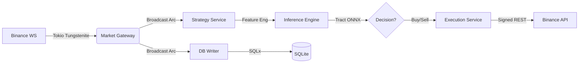

# Binance HFT Bot (RISC-V Edition)

> **A high-frequency algorithmic trading appliance built for the Orange Pi RV2 (RISC-V).**  
> *Rust / Tokio / Tract / SQLite / Fedora / ROCm*

## 📖 Overview

This project represents a shift from traditional cloud-based trading bots to **highly optimized edge computing**. It is a self-contained "Trading Appliance" designed to run on a single-board RISC-V computer (Orange Pi RV2), performing real-time data ingestion, feature engineering, ML inference, and order execution completely on-device.

The core philosophy is **Latency vs. Bandwidth**. By moving the compute to the edge, we eliminate network round-trips for inference and gain complete control over the hardware execution environment.

## 🚀 Philosophy & Vision

### 1. The "Appliance" Model
The bot is not a script running on a VPS; it is an embedded system. The hardware (RISC-V X1-8core) and software (Rust async runtime) are tuned in unison.
*   **Training:** Heavy lifting (Deep Learning) happens on a Fedora Workstation with AMD ROCm GPUs.
*   **Inference:** Optimized ONNX models run efficiently on the RISC-V CPU using `tract`.

### 2. Rust as the Foundation
We use Rust not just for speed, but for **correctness** and **memory safety**.
*   **Type Safety:** `NewType` patterns for Prices and Quantities prevent catastrophic math errors.
*   **Concurrency:** `tokio` actor-based architecture handles massive throughput without race conditions.
*   **Zero-Copy:** Data is ingested via WebSockets and broadcast to analysis engines without unnecessary memory cloning using `Arc<T>`.

### 3. Edge-First Architecture
We explicitly reject the "Jetson Nano" or hybrid approaches that introduce RAM bottlenecks or network latency. The RISC-V architecture offers a modern, efficient instruction set perfect for this specialized workload.

## 🏗 Architecture

The system follows a strict **Ingest -> Process -> Inference -> Execute** pipeline:

### Key Components
*   **Market Gateway:** Manages WebSocket connections (`aggTrade`, `depth20`, `bookTicker`). Handles reconnections and heartbeats automatically.
*   **Strategy Service:** Real-time feature calculator. Computes RSI, Order Book Imbalance (OBI), and Volume Imbalance (TFI) on the fly.
*   **Inference Engine:** Embeds the `tract-onnx` runtime to execute ML models directly within the Rust process.
*   **Execution Service:** Handles HMAC-SHA256 signing and communicates with the Binance Spot API. Includes safety checks for balance and position limits.
*   **Supervisor:** A top-level actor that monitors the health of all services, providing fault tolerance.

## ⚡ Performance & Resilience

### "Production Ready" by Design
*   **LTO Optimization:** Compiled with `lto = "fat"` and `codegen-units = 1` for maximum machine code efficiency on RISC-V.
*   **Zero-Copy Networking:** Leverages `tokio::sync::broadcast` to share immutable market data across threads without cloning.
*   **Database:** Uses `SQLite` in WAL mode for high-speed, local persistence of market history, essential for retraining models.
*   **Systemd Integration:** Runs as a native Linux service with auto-restart capabilities.

## 🛠 Tech Stack

*   **Language:** Rust (2024 Edition)
*   **Runtime:** `tokio` (Async I/O), `futures`
*   **Data Science:** `polars` (DataFrames), `ndarray` (Tensors), `ta` (Technical Analysis)
*   **ML Runtime:** `tract-onnx` (Neural Network Inference)
*   **Database:** `sqlx` (Async SQLite)
*   **Networking:** `reqwest`, `tokio-tungstenite`
*   **Training (Offline):** Python, PyTorch, AMD ROCm

## 🚧 Status & Roadmap

**Current Status:** Alpha (Live Testing)
*   ✅ Real-time WebSocket ingestion (Zero-copy)
*   ✅ On-device ONNX inference
*   ✅ Live order execution (Spot Market)
*   ✅ Telegram notifications (`teloxide`)

**Future Work:**
*   **Advanced Models:** Transition from FFN to LSTM/GRU for time-series memory.
*   **Derivatives:** Integration of Futures data (Funding Rates, Open Interest).
*   **TUI Dashboard:** A terminal-based UI for monitoring system health and PnL.
*   **Triple Barrier Labeling:** Advanced training targets for better risk/reward ratios.

## ⚠️ Disclaimer
*This software is for educational and research purposes only. High-frequency trading involves significant financial risk. Use at your own risk.*
